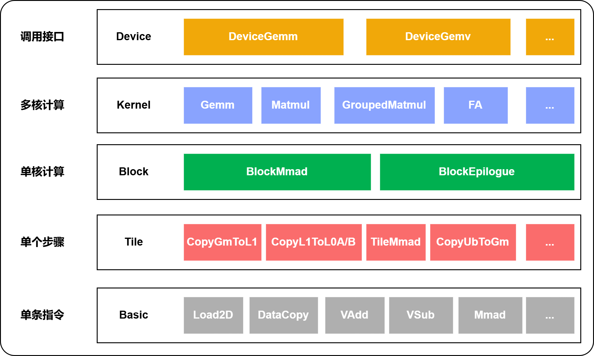

# CATLASS Gemm API

CATLASS针对NPU上不同层级上执行的矩阵乘累加（MMAD）操作，提供了一个统一的编程模型。CATLASS的Gemm API对应于以下分层，由高到低分别是：



# CATLASS Gemm模型
CATLASS基于上述的分层结构，实现了经典“三层嵌套循环”的矩阵乘算法。

以下伪代码描述了针对像`mmad`这样的单核内同步矩阵乘法指令的Matmul 内核的模型。整个算子被称为“Matmul”，这是伪代码，仅用于说明哪些层次的部分对应于矩阵乘的内部或外部循环。


```c++
// Catlass::Gemm::Kernel::BasicMatmul: BlockTileM 和 BlockTileN 循环
// 在AICores上并行
for (int block_m = 0; block_m < MatmulM; block_m += BlockTileM) {
  for (int block_n = 0; block_n < MatmulN; block_n += BlockTileN) {

    // Catlass::Gemm::Block::BlockMmad: 在k-tile上迭代的主循环
    // 在这个阶段没有循环展开
    for (int k_tile = 0; k_tile < MatmulK; k_tile++) {

      // tileMma内的循环 (m,k) x (k,n) => (m,n)
      // TileMmad使用硬件指令 AscendC::Mmad
      for (int tile_mma_m = 0; tile_mma_m < m; tile_mma_m++) {
        for (int tile_mma_n = 0; tile_mma_n < n; tile_mma_n++) {
          for (int tile_mma_k = 0; tile_mma_k < k; tile_mma_k++) {
            mmad.call(c, a, b);
          } // tile_mma_k
        } // tile_mma_n
      } // tile_mma_m
    } // k_tile mainloop
  } // block_n
} // block_m
```

前两重嵌套的 `for`循环对应于多个AICore上的并行性。代码上并不将它们显示地表达为两重for循环，而是通过BlockIdx来区分不同核心处理的数据块。

在两重嵌套的 `for`循环内部，将全局内存分片，然后将分片搬运到更“局部”的内存（如L1 Buffer或L0 Buffer）并执行MMAD计算。这些分片拷贝和分片MMAD计算的迭代通常是完全静态的，并且完全展开。


# CATLASS Gemm组件


CATLASS使用以下组件表达上述循环嵌套，这些组件针对数据类型、数据排布和数学指令进行特化。


| API 层级             | API 类 和/或 函数 名称                   |
| ---                  | ---                                               |
| Device               | `Catlass::Gemm::Device::DeviceGemm`     |
| Kernel               | `Catlass::Gemm::Kernel::BasicMatmul`            |
| Block           | `Catlass::Gemm::Block::BlockMmad` <br /> `Catlass::Epilogue::Block::BlockEpilogue` <br />|
| Tile (MMAD and Copy) | `TileMmad` and `TileCopy` <br /> |
| Basic                 | `AscendC::Mmad` and `AscendC::DataCopy` |

在CATLASS中，我们通过首先在Kernel层组合Block主循环和Block后处理，然后用主机侧适配器包装它们来组装内核。


用户使用这些组件组装内核时，需要通过以下顺序实例化。
1. 组装所需的Block主循环和Block后处理。
2. 将Blocks组合在一起构建成Kernel。
3. 用Device层适配器包装Kernel。

这个顺序也反映在CATLASS的示例中[examples/00_basic_matmul](../examples/00_basic_matmul)，如下文摘录所示。


```c++
// 第一步: 创建所需的特化block层mmad
// 参数
using DispatchPolicy = Gemm::MmadAtlasA2Pingpong<true>;
using L1TileShape = GemmShape<128, 256, 256>;
using L0TileShape = GemmShape<128, 256, 64>;
using AType = Gemm::GemmType<ElementA, LayoutA>;
using BType = Gemm::GemmType<ElementB, LayoutB>;
using CType = Gemm::GemmType<ElementC, LayoutC>;

using BlockMmad = Gemm::Block::BlockMmad<DispatchPolicy,
    L1TileShape,
    L0TileShape,
    AType,
    BType,
    CType>;

// 第二步：指定block层的后处理类型（可选）
using BlockEpilogue = void;

// 第三步：指定计算时的数据走位方式
using BlockScheduler = typename Gemm::Block::GemmIdentityBlockSwizzle<>;


// 第四步：在kernel层将mmad和后处理组合到一起
using MatmulKernel = Gemm::Kernel::BasicMatmul<BlockMmad, BlockEpilogue, BlockScheduler>;

// 第四步：将kernel放入device适配器中，host侧处理kernel使用
using Matmul = Catlass::Gemm::Device::DeviceGemm<MatmulKernel>;
```


## Block API

Block API包括“矩阵乘累加”和后处理。它负责实现上述三层嵌套循环伪代码中的`k_tile`循环。

Block在昇腾NPU的SPMD编程模型中指一个Process，是逻辑核的概念。它提供的硬件特性包括：
* 异步内存拷贝（例如，从全局内存到L1 Buffer）；
* 适用于L0 Buffer中的分片粒度数据的MMAD指令；
* 多核间、核内不同流水线间的同步操作，用以确保异步操作之间的数据依赖关系得到满足。

Block使用`TileMma`和`TileCopy` API（见下文）来执行分片粒度的数据拷贝和MMAD运算。

Block中的不同硬件流水线（例如，MTE1、MTE2或FixPipe）提供不同能力，不同的硬件流水线间需要共享数据并协调对共享数据的访问。例如，MTE2将数据从全局内存拷贝到L1 Buffer后，需要让MTE1知道输入已准备好。这里`Kernel::`层负责对`Block::`层接口进行调用，`Block::`层接口负责独立的C矩阵分块计算。

### Block Mmad

`Catlass::Gemm::Block::BlockMmad`Block矩阵乘累加（MMAD）主循环的主要接口。

The `BlockMmad` 类定义在头文件中
[include/catlass/gemm/block/block_mmad.hpp](../include/catlass/gemm/block/block_mmad.hpp).

```c++
namespace Catlass::Gemm::Block {
////////////////////////////////////////////////////////////////////

template <
    class DispatchPolicy,
    class L1TileShape,
    class L0TileShape,
    class AType,
    class BType,
    class CType,
    class BiasType = void,
    class TileCopy = Gemm::Tile::TileCopy<typename DispatchPolicy::ArchTag, AType, BType, CType, BiasType>,
    class TileMmad = Gemm::Tile::TileMmad<typename DispatchPolicy::ArchTag, AType, BType, BiasType>
>
struct BlockMmad {};

////////////////////////////////////////////////////////////////////

} // namespace Catlass::Gemm::Block

```

- `DispatchPolicy` 是Block层重要的参数之一，下一节会详细介绍。
- `L1TileShape` 和 `L0TileShape` 对应L1 Buffer和L0 Buffer上使用的基本块大小，后续详细介绍。
- `AType`、`BType`、`CType`、`BiasType` 是 `GemmType` 的实例，其中包含了全局内存上A、B、C矩阵和Bias向量的数据类型和数据排布。
- `TileCopy` 是 `Tile::TileCopy`的实例，包含了不同访存层级间的块粒度数据拷贝，如全局内存到L1 Buffer，L1 Buffer到L0 Buffer等。
- `TileMmad` 是 `Tile::TileMmad`的实例，完成L0上基本块粒度的矩阵乘累加运算。


### Block Dispatch Policies

`BlockMmad`的实现不是通用的。相反，它们必须针对每个算法和NPU架构特例化。用户可以通过选择与该特例化匹配的模板参数来调度到`BlockMmad`的特例化。
CATLASS采用基于标签的调度策略类型来特例化Block层Mmad实现，并为其提供调优能力。

以下给出了一个Dispatch Policy的样例，对应AtlasA2的架构下，采用L1 Buffer上pingpong Buffer，启用unitflag优化：

```c++
// 2-Buffer in L1 Buffer ,
// unitflag enable
struct MmadAtlasA2Pingpong {
    using ArchTag = Arch::AtlasA2;
    static constexpr uint32_t STAGES = 2;
    static constexpr bool ENABLE_UNIT_FLAG = True;
};
```


`STAGES` 参数使用户可以方便的调整多buffer场景的buffer片数，`ENABLE_UNIT_FLAG` 参数用于表示是否启用Mmad运算与L0C结果拷贝到全局内存的细粒度并行。

采用Dispath Policy的设计还有如下优点：
- 它避免了代码重复，主循环可以与多个不同的内核使用。
- 它使编写通用代码更容易，因为主要类型名称`BlockMma`在任何实现中都不会改变。
- 它提供了一个清晰、单一的扩展点，供用户插入针对他们自己调度策略特化实现的新的、定制的主循环。


### TileShape
`L1TileShape` 和 `L0TileShape` 对应L1 Buffer和L0 Buffer上使用的基本块大小，由（m,n,k）表示

### Epilogue


尾处理实现了涉及输出矩阵的逐元素操作。用户可以提供自定义的尾处理，或者使用标准尾处理之一。这些尾处理位于目录include/catlass/epilogue/block/中，包括像`Catlass::Epilogue::Block::BlockEpilogue`这样的类。CATLASS提供的尾处理不在include/catlass/gemm目录下，也不在`Catlass::Gemm`命名空间中，因为它们可以用于除Gemm之外的其他计算。


## Kernel API

Kernel对应了所有Block在NPU上执行逻辑的集合。Kernel层BasicMatmul承担以下功能：
- 对包含的不同Block的逻辑进行组合，加入必要的同步逻辑。
- 不同Block和处理全局内存上数据的对应关系（Swizzling）。
- 将输入数据在Block粒度分片。

Kernel层API是设备侧调用的入口，也是融合连续矩阵乘、尾处理或其他操作的组合点。

Kernel API 入口在
`Catlass::Gemm::Kernel::BasicMatmul`, 位于头文件
[include/catlass/gemm/kernel/basic_matmul.hpp](/include/catlass/gemm/kernel/basic_matmul.hpp).
`BasicMatmul` 是一个无状态的设备侧内核，实现的矩阵乘运算由两部分组成：
* Block Mmad
* Block Epilogue

```cpp
namespace Catlass::Gemm::Kernel {
template <
  class BlockMmad_,
  class BlockEpilogue_,
  class BlockScheduler_
>
class BasicMatmul;
} // namespace Catlass::Gemm::Kernel
```

注：无状态指调用者管理着内核的状态。例如，上述描述的设备API。内核仅接收输入和输出参数 (`Params`).


其中 *Block Mmad* 代表局部数据块上的矩阵乘加运算，*Block Epilogue* 代表mmad之后的运算,例如`C := beta * C + alpha * A * B`中的 `beta * C` 。


## Device API

Device层是Host侧调用的入口，在这一层屏蔽调用Device侧函数的差异。用户定义完Kernel结构之后放入Device层模板，便可以执行算子。
```
using BlockMmad = Gemm::Block::BlockMmad<DispatchPolicy, L1TileShape, L0TileShape, AType, BType, CType>;
using BlockEpilogue = void;
using BlockScheduler = typename Gemm::Block::GemmIdentityBlockSwizzle<>;

// kernel
using MatmulKernel = Gemm::Kernel::BasicMatmul<BlockMmad, BlockEpilogue, BlockScheduler>;

// device
using Matmul = Gemm::Device::DeviceGemm<MatmulKernel>;
Matmul matmulOp;
// args为维度信息等参数的封装结构体
matmulOp(args, workspace, stream);
```

## Tile MMAD and Copy

Tile粒度的MMAD和Copy是对基础API的MMAD和数据拷贝接口的组合，这一层的目的是构建可组合的NPU微内核，这些微内核由硬件加速的数学运算和数据拷贝操作组成，每个操作都有其数据类型和排布。Tile粒度的MMAD和Copy提供了不同硬件上完成相同计算或数据拷贝语义的统一API。

用户可以在本文档顶部的三重嵌套循环伪代码的“内层”循环中使用`Tile::TileMmad()` 或`Tile::CopyGmToL1()` 、`Tile::CopyL0CToGm()` 等来调用这些操作。

我们将这个API层级称为“Tile”，因为它使用基础API提供的原子能力去构建更大粒度的操作，作为一个可重用组件，它就像将单独的瓷砖拼接在一起构建成马赛克的图案。

## Basic API

Basic层级API封装了实际的硬件指令调用，这些指令加速了MMAD或数据拷贝操作，对应CATLASS的基础API，实现了对硬件能力的抽象，开放了芯片能力，保证了完备性和兼容性，其中ISASI类API，不保证跨硬件版本兼容。


## 版权声明
Copyright (c) 2025 Huawei Technologies Co., Ltd.

This file is a part of the CANN Open Software.
Licensed under CANN Open Software License Agreement Version 1.0 (the "License").
Please refer to the License for details. You may not use this file except in compliance with the License.

THIS SOFTWARE IS PROVIDED ON AN "AS IS" BASIS, WITHOUT WARRANTIES OF ANY KIND,
EITHER EXPRESS OR IMPLIED,
INCLUDING BUT NOT LIMITED TO NON-INFRINGEMENT,
MERCHANTABILITY, OR FITNESS FOR A PARTICULAR   PURPOSE.
See LICENSE in the root of the software repository for the full text of the License.

## 许可证
[CANN Open Software License Agreement Version 1.0](../LICENSE)
